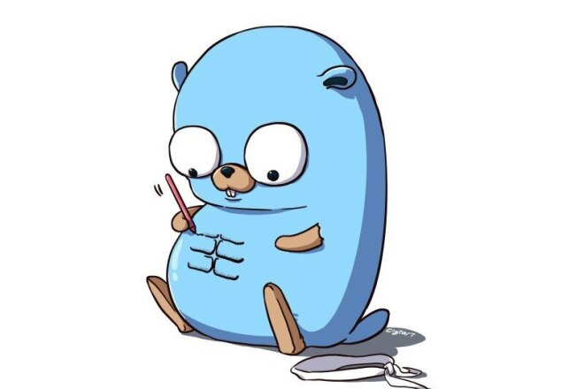
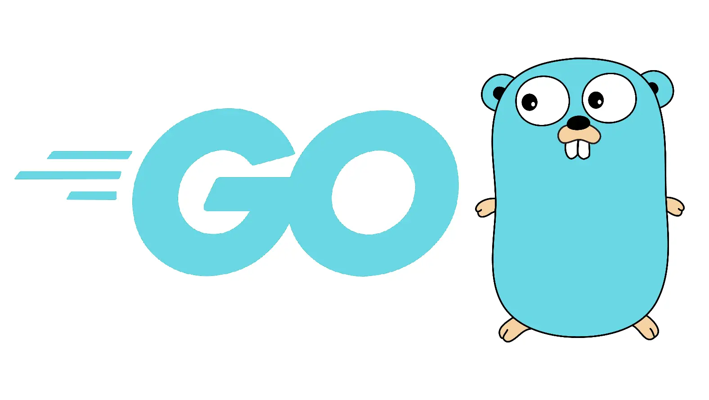

# Академия Бэкенда — Go Edition 

Приветствую тебя, странник!

В этом репозитории собраны результаты моих pet-проектов на Go — оформлено в духе курса Т-банка "Академия Бэкенда".  
Каждый проект представлен в отдельном модуле: что делает код, как устроено «под капотом», какие ключевые файлы за что отвечают, стек и краткая инструкция по запуску. Проекты расположены по уровню технической сложности — от самого архитектурно насыщенного к более компактным.

---

## Содержание
- Как ранжированы проекты  
- Модуль 1 — go-grpc-graphql-microservices  
- Модуль 2 — go-ecommerce-project  
- Модуль 3 — Go-and-React-Full-Stack-App  
- Модуль 4 — GopherSocial  
- Модуль 5 — golang-restaurant-management-backend  
- Модуль 6 — gRPC_service_on_Go_Authorization_Service  
- Модуль 7 — REST-API-service-on-Go  
- Общие замечания по запуску  
- Контакты

---

## Как ранжированы проекты
Ранг выставлен по совокупности: архитектурная сложность (микросервисы, gateway, gRPC/GraphQL), полнота стека (БД, поиск, кеши), наличие frontend-слоя, готовность к локальному развёртыванию (docker-compose, генерация protobuf) и практическая ценность для резюме.

---

### Модуль 1 — **go-grpc-graphql-microservices**

**Коротко.** Комплект независимых сервисов, общающихся по gRPC, с фронтом в виде GraphQL API-gateway. Полезен как эталон многосервисной архитектуры.

**Что делает код.**  
Проект состоит из трёх базовых сервисов: сервис учётных записей, сервис каталога и сервис заказов. Каждый сервис реализует свою предметную логику и взаимодействует с собственным хранилищем. GraphQL-gateway агрегирует данные разных сервисов и выдаёт унифицированный API клиентам. Catalog индексирует данные в Elasticsearch для полнотекстового поиска; Order содержит логику корзины, расчёта сумм и создания заказов; Account обрабатывает регистрацию, профили и аутентификацию на уровне сервиса.

**Стек.** Go, gRPC (protobuf), GraphQL, PostgreSQL, Elasticsearch, Docker / Docker Compose, инструменты для генерации protobuf.

**Ключевые файлы и структура (чем смотреть):**
- `account/` — proto описания для account, реализация сервера, модели и миграции; отвечает за пользователей и профильные данные.  
- `catalog/` — сервис продуктов, содержит индексатор для Elasticsearch и методы поиска/фильтрации.  
- `order/` — логика корзины и заказов, обработка транзакций на уровне сервиса.  
- `graphql/` — схема GraphQL и резолверы, слой агрегации gRPC вызовов.  
- `docker-compose.yaml` — полное дев-окружение: БД, ES, сервисы и gateway.

**Как запустить (кратко).** Клонировать репозиторий, при необходимости сгенерировать protobuf по инструкциям в репо, запустить окружение через docker-compose и открыть GraphQL-интерфейс gateway.

**Подробности реализации.**  
Контракты между сервисами жёстко заданы в .proto; изменение контрактов требует регенерации pb. GraphQL резолверы выполняют синхронные gRPC-вызовы и собирают агрегированный ответ. Elasticsearch применяется для быстрого поиска и сложных фильтров по каталогу, что требует корректной настройки индексных маппингов и импорта данных при инициализации.

**Что показательно для резюме.** Проект демонстрирует умение проектировать распределённые системы, связывать gRPC и GraphQL, организовывать CI для генерации protobuf и развёртывания multi-service окружения.

---

### Модуль 2 — **go-ecommerce-project**

**Коротко.** Практический e-commerce backend: аутентификация, каталог товаров, корзина и оформление заказов. Фокус на предметной модели интернет-магазина.

**Что делает код.**  
Реализована регистрация и вход пользователей с выдачей токенов, CRUD-операции для товаров, механика корзины (добавление товаров, подсчёт итогов) и процесс оформления заказа с созданием записи заказа и обновлением состояния запасов. Код покрывает реальные сценарии: валидацию входных данных, управление сессиями и базовые бизнес-правила при checkout.

**Стек.** Go, база данных (настройка через конфиг: MongoDB или PostgreSQL в зависимости от конфигурации), JWT для аутентификации, Docker (опционально).

**Ключевые файлы и структура:**
- `controllers/` — HTTP-обработчики для auth, продуктов, корзины и заказов.  
- `models/` — доменные структуры: User, Product, CartItem, Order.  
- `routes/` — маршрутизация и middleware (включая auth).  
- `database/` — инициализация соединения с БД и миграции.  
- В корне — инструкции по конфигурации окружения и, при наличии, docker-compose.

**Как запустить (кратко).** Клонировать, подготовить переменные окружения (строка подключения к БД и секреты), затем запустить сервис локально или через docker-compose, следуя README проекта.

**Подробности реализации.**  
В коде реализованы проверки наличия товара при оформлении заказа и атомарные операции на уровне сервиса для предотвращения расхождений стока. Auth реализован с разделением access/refresh токенов и middleware для защиты эндпоинтов.

**Что показательно для резюме.** Реализация полного бизнес-флоу электронной коммерции, управление транзакциями и практические навыки работы с auth и состоянием корзины.

---

### Модуль 3 — **Go-and-React-Full-Stack-App**

**Коротко.** Full-stack демонстрация: современный React-frontend и Go-backend, связка через REST API, хранение данных в MongoDB.

**Что делает код.**  
Frontend реализует формы и представления для CRUD-операций, использует клиентский кэш и хуки для работы с API. Backend предоставляет REST-эндпоинты, выполняет валидацию, бизнес-логику и взаимодействует с MongoDB. Проект демонстрирует end-to-end интеграцию и работу с клиентским кэшем.

**Стек.** React (TypeScript, UI библиотека), TanStack Query (или эквивалент) на клиенте, Go на сервере, MongoDB в качестве БД.

**Ключевые файлы и структура:**
- `client/` — исходники React приложения: страницы, компоненты, сервисы API.  
- `server/` или корневой `backend` — маршруты, обработчики, модели и подключение к БД.  
- `.env.example` — шаблон конфигурации для работы обеих частей.

**Как запустить (кратко).** Подготовить окружение (URI к MongoDB), запустить backend и отдельно frontend, убедиться, что переменные окружения корректно настроены.

**Подробности реализации.**  
Ключевая ценность — демонстрация паттернов работы клиента с сервером: кэширование запросов, invalidation после мутаций, оптимистические обновления и разделение валидации на клиент-сервер.

**Что показательно для резюме.** Навык связки UI и API, понимание trade-offs между клиентским и серверным состоянием, опыт с современным стеком фронтенда.

---

### Модуль 4 — **GopherSocial**

**Коротко.** Мини-социальная платформа: пользователи, посты, лента. Проект служит учебным кейсом по проектированию API и пользовательских потоков.

**Что делает код.**  
Реализованы механики создания/редактирования/удаления постов, управление профилем пользователя, middleware аутентификации и выдачи JWT, а также получение ленты с базовой пагинацией и сортировкой.

**Стек.** Go, БД по конфигурации проекта (Postgres/Mongo), JWT аутентификация.

**Ключевые файлы и структура:**
- `routes/posts.go`, `handlers/posts_handler.go` — обработка операций с постами.  
- `middleware/auth.go` — проверка токенов и извлечение контекста пользователя.  
- `models/` — структуры постов и пользователей.

**Как запустить (кратко).** Клонировать, подготовить переменные окружения и запустить сервис согласно инструкциям в репозитории.

**Подробности реализации.**  
Лента реализована с учётом базовой оптимизации запросов к БД, предусмотрены индексы по времени публикации и полям фильтрации, middleware обеспечивает защиту приватных эндпоинтов.

**Что показательно для резюме.** Навыки проектирования REST API для пользовательских продуктов, управление сессиями и оптимизация чтения ленты.

---

### Модуль 5 — **golang-restaurant-management-backend**

**Коротко.** Backend для управления рестораном: меню, заказы, столы и статусы заказов.

**Что делает код.**  
Обеспечивает CRUD для пунктов меню, хранение и изменение статусов заказов (такие как placed, in_progress, ready, served), управление резервированием столов и привязку заказа к столу. Включена логика переходов состояний и базовая валидация бизнес-правил.

**Стек.** Go, БД (Postgres/SQLite по конфигу), возможна интеграция с Docker.

**Ключевые файлы и структура:**
- `models/menu.go` — описание сущности пункта меню.  
- `handlers/order_handler.go` — обработка жизненного цикла заказа.  
- `services/table_service.go` — управление столами и бронью.

**Как запустить (кратко).** Клонировать, настроить параметры подключения к БД и запустить сервис согласно README.

**Подробности реализации.**  
Реализована state-machine для статусов заказа, учтены ограничения на бронирование столов и сценарии одновременного доступа.

**Что показательно для резюме.** Проект демонстрирует моделирование предметных процессов и управление сложным состоянием в бизнес-логике.

---

### Модуль 6 — **gRPC_service_on_Go_Authorization_Service**

**Коротко.** Авторизационный микросервис на gRPC: Login, Refresh, Validate — выдача JWT и управление refresh-token'ами.

**Что делает код.**  
Определяет в .proto интерфейс авторизации, реализует серверную логику выдачи и верификации JWT, хранение/аннулирование refresh-токенов и методы для проверок валидности токена. Сервис предназначен для интеграции с другими микросервисами.

**Стек.** Go, gRPC (protobuf), хранилище для refresh-tokens (БД/Redis).

**Ключевые файлы и структура:**
- `.proto` файлы — контракт сервиса.  
- `server/` — реализация методов Login/Refresh/Validate.  
- `scripts` или README — инструкции по генерации protobuf.

**Как запустить (кратко).** Установить protoc и плагины для Go, сгенерировать pb-файлы и запустить сервис локально или в контейнере.

**Подробности реализации.**  
Сервис реализует separation of concerns: централизованное управление auth позволяет вынести ответственность за безопасность из бизнес-сервисов и стандартизировать протокол взаимодействия.

**Что показательно для резюме.** Умение проектировать и реализовывать инфраструктурные сервисы, знание работы с JWT и распределёнными токенами обновления.

---

### Модуль 7 — **REST-API-service-on-Go**

**Коротко.** Компактный production-ориентированный REST-сервис (типичный пример — URL shortener или content API). Акцент на надежности и корректной обработке ошибок.

**Что делает код.**  
Предоставляет набор REST-эндпоинтов с валидацией входных данных, централизованной обработкой ошибок, health-checks и поддержкой конфигурируемых middlewares для логирования и безопасности.

**Стек.** Go, БД по конфигурации, стандартные практики логирования и health-monitoring.

**Ключевые файлы и структура:**
- `cmd/` или `main.go` — точка входа и конфигурация сервиса.  
- `internal/` или `handlers/` — обработчики и middlewares.  
- `pkg/` — утилиты и вспомогательные пакеты.

**Как запустить (кратко).** Клонировать, подготовить конфиг/переменные окружения и выполнить запуск сервиса согласно README.

**Подробности реализации.**  
Сервис оформлен по шаблонам «production ready»: разделение конфигурации, тестируемые обработчики и возможность бесшовного развёртывания в контейнере.

**Что показательно для резюме.** Чистая реализация REST-контрактов, обработка ошибок и готовность к деплою.

---

## Общие замечания по запуску
- Для проектов с protobuf нужно установить protoc и плагины для Go и запустить шаг генерации pb, если в репозитории это предусмотрено.  
- Для проектов с docker-compose достаточно поднять окружение через docker-compose up и дождаться поднятия БД/зависимостей.  
- Используйте `.env.example` как шаблон для заполнения переменных окружения перед запуском.  
- В проектах, где есть frontend, frontend и backend запускаются отдельно, каждый со своей конфигурацией окружения.

---

## Контакты
GitHub: https://github.com/LanGraFyodor

---
